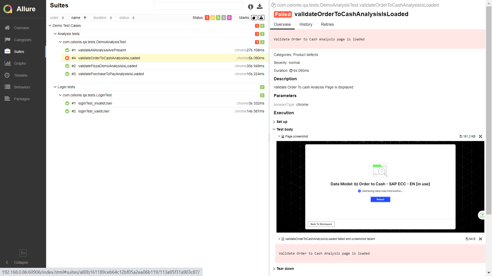

# Celonis QA Task

### Task 1 - Manual Tests
	- ManualTest.xlsx is available in project location

### Task 2 - Automation Tests

## Automation Framework tools
	- Automation tool library = Selenium / Webdriver 3.0
	- Testing Library = TestNG
	- Reporting = Allure report 
	- Project build tool = Maven
	- Repo - github

## Automation Framework Features
	- Framework is designed using Page Object model pattern using PageFactory class
	- Framework support multiple browsers.
	- Parallel execution is supported at different levels - 'tests', 'classes'
	- Framework is ready to execute test cases both locally and on Remote machine (browserstack)
	- All data is maintained in properties file.
	- Screenshot and logs captured for failures and are available in reports

## Pre-requisite for setup
	- java 1.8 or higher
	- Maven
	- Allure command line tool
	- Browsers - chrome, firefox

## Steps to Run the scripts

	1. Checkout git repo https://github.com/manglic/Celonis-qa-task
	2. open terminal and cd to project folder(Celonis-qa-task) (where pom is located)
	3. Execute command 'mvn clean install'
	4. Execute 'allure serve' (after execution is completed)

## Allure report Screeshot 
 

## Test files and test scenarios
Test File 1 - LoginTest.java

	1. Login into the application with valid user
	2. login into the application with invalid user

Test File 2 - DemoAnalysisTest.java
	
	1. Validate all demo analysis are available on Analytics page
	2. Validate Pizza Demo Analysis is loaded
	3. Validate Order to Cash analysis is loaded
	4. Validate Purchase to Pay analysis is loaded

## Bug Encountered 
- Order to Cash Analysis page fails to load